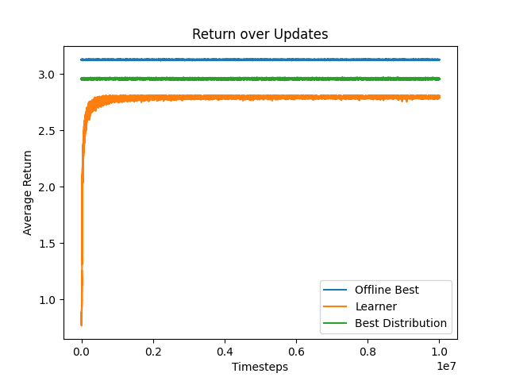

# Prophet Inequality
This is work done for [CMPUT 676 Assignment 1 Part (b) Winter 2022](https://xiaoqitan.org/teaching/optimization/).
The goal is to use various approaches to solve the standard setting with prophet inequalities.

## Installation
### Prerequisites:
- Python 3.10

You may install the package using pip (preferably under virtual environment):
```
cd ${PATH_TO_PROJECT_DIR}
pip install -e .
```

### Experiments
The experiments reside in the `scripts` directory. You may simply run the files for corresponding experiments:
```
# For part (i)
python experiment_single_item.py

# Sample outputs ----------------------------------------------------------------------
# Obtained lambda: 137.6581701249638
# The empirical expected ratio between ALG and max_i X_i for lambda is 0.7066308110047568
# Obtained eta: 227.48298772869038
# The empirical expected ratio between ALG and max_i X_i for eta is 0.8967378890541423
# The empirical expected ratio between ALG and max_i X_i for random agent is 0.451373960521208

# For parts (ii) & (iii)
python experiment_multi_item.py

# Sample outputs ----------------------------------------------------------------------
# Obtained lambda: 264.66004646463745
# The empirical expected ratio between ALG and max_i X_i for lambda is 0.46685194557759335
# Obtained eta: 227.48298772869038
# The empirical expected ratio between ALG and max_i X_i for eta is 0.474515789155883
# The empirical expected ratio between ALG and max_i X_i for random agent is 0.459901796633847

# For part (iv)
# This will generate a return plot between OPT (i.e. true max of that particular episode), best loc (i.e. best fixed policy), and REINFORCE learner. The regret can be computed by taking the difference between best loc and REINFORCE learner.
# Further note that tuning this is fairly difficult because it is easy for the agent to prematurely commit to a single action
python experiment_rl.py
```
Note that for `experiment_multi_item.py`, we will need to change `num_accepts` to modify `k`.

For RL, we only ran a single seed with 10M timesteps on the single-item setting. Preliminary result shows that there remains a suboptimality gap between the best arm vs learner. See image below


### Code Structure
```
.
├── prophet_inequality/
│   ├── agent.py # policies/learners
│   ├── constants.py # shared constant variables
│   ├── environment.py # various problem formulations of prophet inequalities
│   ├── interaction.py # code to interact with the problem instances
│   └── utils.py # helper code
└── scripts/
    ├── experiment_single_item.py # experiment script for (i)
    ├── experiment_multi_item.py # experiment script for (ii) & (iii)
    └── experiment_rl.py # experiment script for (iv)
```

#### Agents
We provide multiple agents for prophet inequalities:
- `Threshold`: Accept as long as value is above specified threshold
- `Randomized`: Accept based on a bernoulli distribution
- `RandomizedThreshold`: Accept when value is above specified threshold or when we get a `1` from bernoulli distribution
- `REINFORCE`: A policy is learned based on experiences with different problem instances
